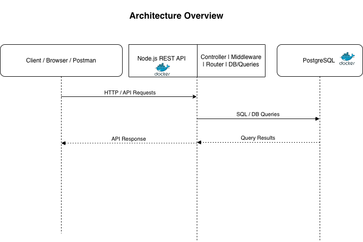

# 📝 NoteWatch — Backend API (Development)

**NoteWatch** is a production-style backend API built to simulate a realistic application lifecycle, from API development to containerized service integration.  
The project focuses on **secure API design, authentication, and reliable communication with a containerized PostgreSQL database inside a private Docker network**.

This repository represents the **development layer** of the system, intentionally designed to integrate cleanly with containerized infrastructure, load balancing, and secure production exposure.

---


## 🏗️ Architecture Overview



---

## 🎯 Project Objectives

- Build a secure, role-based CRUD API from scratch
- Integrate a containerized PostgreSQL database
- Design services to communicate over a private Docker network
- Understand how application design impacts containerized deployments
- Produce an API suitable for load balancing and production use

---

## 🚀 Core Features

### 🔐 Authentication & Authorization
- JWT-based authentication (stateless)
- Role-based access control (`user` / `admin`)
- Protected routes enforced via authorization middleware

### 🗂️ User-Owned CRUD Operations
- Full Create, Read, Update, Delete operations on notes
- Notes strictly scoped to authenticated users
- Admin role with elevated access permissions

### 🔒 Secure API Access
- Token-based authorization (no session storage)
- Environment-based secrets and configuration

### 📊 Centralized Request Metadata Logging
- Logs request metadata including:
  - HTTP method
  - Endpoint
  - Timestamp
  - Client IP address
  - User-Agent
- Designed to support debugging, auditing, and observability

---

## 🧱 Application Architecture (Development Focus)

### Backend API
- Node.js REST API
- Modular structure with clear separation of concerns
- Authentication, authorization, and logging implemented as middleware
- Health check endpoint included to support orchestration and load balancing

### Database (PostgreSQL)
- PostgreSQL running in its own Docker container
- Relational schema designed to support:
  - User ownership
  - Role-based access enforcement
  - Data integrity and constraints
- Database traffic from the application flows exclusively over a private Docker network
- External access is restricted to the VM environment for development and administration use


---

## 🐳 Docker & Networking (Design Considerations)

The application was **designed with containerized environments in mind from the start**, rather than adapted later.

- **Multi-Container Architecture**
  - API and PostgreSQL run in separate containers
  - Clear separation between application and data layers

- **Custom Docker Bridge Network**
  - Services communicate over a private Docker bridge network
  - PostgreSQL is not publicly exposed
  - Networking configured explicitly to mirror production patterns

- **Persistent Data Storage**
  - PostgreSQL uses Docker volumes for data persistence
  - Container restarts do not result in data loss

- **Environment-Based Configuration**
  - Database connection details injected via environment variables
  - Supports multiple environments without code changes

---

## 🧠 Why This Project Matters

This project was intentionally built in order to:

- Understand how APIs interact with containerized databases
- Learn how service isolation and private networking improve security
- Experience the full lifecycle of building and connecting services in Docker
- Bridge the gap between backend development and DevOps practices

The result is a backend API that is **simple, secure, database-backed, container-ready, and suitable for production deployment behind a reverse proxy and load balancer**.

---

## 🔮 Future Improvements

- CI/CD pipeline for automated builds and deployments
- Centralized logging and metrics collection
- Secrets management using a dedicated secrets store
- Database migrations and schema versioning improvements
- Rate limiting and additional API hardening

---


```bash
